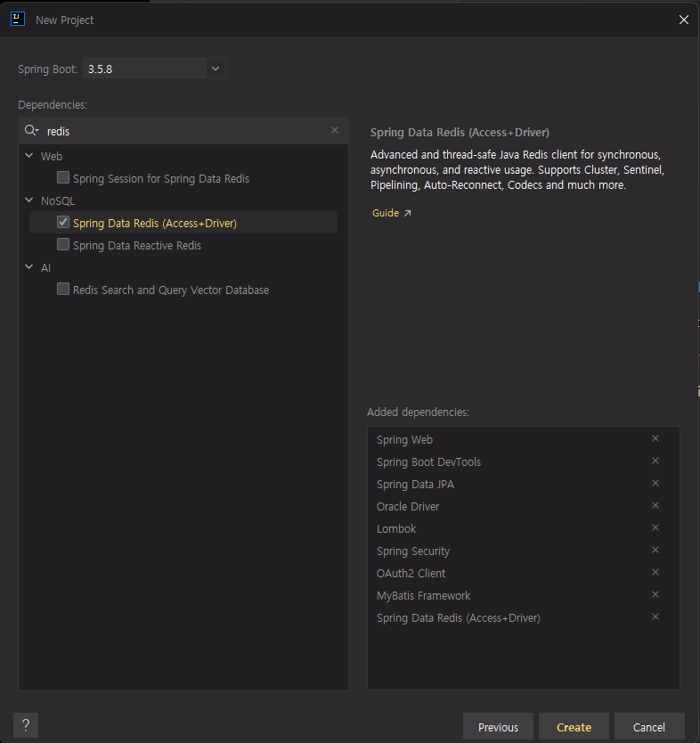

# Trendlens API

#### 개발환경
<!--  -->
 
1. Spring Boot Version: 3.5.8
2. 의존성
   - 기본 프레임워크
     - Spring Web
     - Spring Boot DevTools
   - 데이터베이스 관련
     - Spring Data JPA
     - MyBatis Framework
     - Spring Data Redis(Access + Driver)
     - Oracle Driver
   - 시큐리티
     - Spring Security
     - OAuth2 Client
   - 기타 라이브러리
     - Lombok